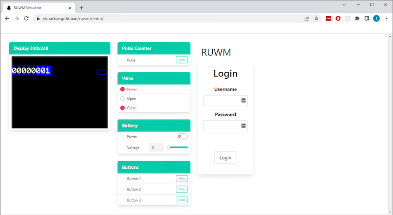

# ruwm
[Ru]st [W]ater [M]eter - my explorations into an embedded, async, real-world project

[](https://github.com/ivmarkov/ruwm/actions/workflows/ci.yml)
[](https://ivmarkov.github.io/ruwm/ruwm/index.html)

**WIP**

# [DEMO](https://ivmarkov.github.io/ruwm/demo/) 

Once in, hit F12 in the browser window to open the Dev Tools Console and see the demo logs.
[](https://ivmarkov.github.io/ruwm/demo/)


# How to build?

Easiest is to build the demo. 
* The demo is the actual Water Meter Rust application - together with its Web UI - deployed as a browser (WASM) application.
* The left part of the screen is [`hal-sim`](https://github.com/ivmarkov/hal-sim) - a small [`embedded-hal`](https://github.com/rust-embedded/embedded-hal) & [`embedded-graphics`](https://github.com/embedded-graphics/embedded-graphics) simulator that implements the GPIO, ADC and Display traits and allows the user to interact with these via the browser.

To build:
* Get [rustup](https://rustup.rs/).
* Switch to Rust nightly and add the wasm target
```sh
rustup default nightly
rustup update nightly
rustup target add wasm32-unknown-unknown
```
* Install [Trunk](https://github.com/thedodd/trunk)
```sh
cargo install trunk
```

* Clone, build and run the simulator demo app
```
git clone https://github.com/ivmarkov/ruwm
cd ruwm/ruwm-sim
trunk serve -w . -w ../ruwm -w ../ruwm-web
```

* Go to [http://localhost:8080/](http://localhost:8080/) to see the demo in action
* Hit F12 in the browser to see the app logs in the Dev Tools Console

# Faster edit-compile-deploy-test cycle

Note that the demo you are running via Trunk is - in fact - **live**. You can change from e.g. VSCode any part of the app code (its backend that would in reality run on the actual MCU, or the Web UI) and then hit save and - volilla - in a few seconds Trunk will reload the app in the browser!

A bit like Frontend development workflow, but for embedded.

# How to build the actual ESP32 firmware?

TBD
